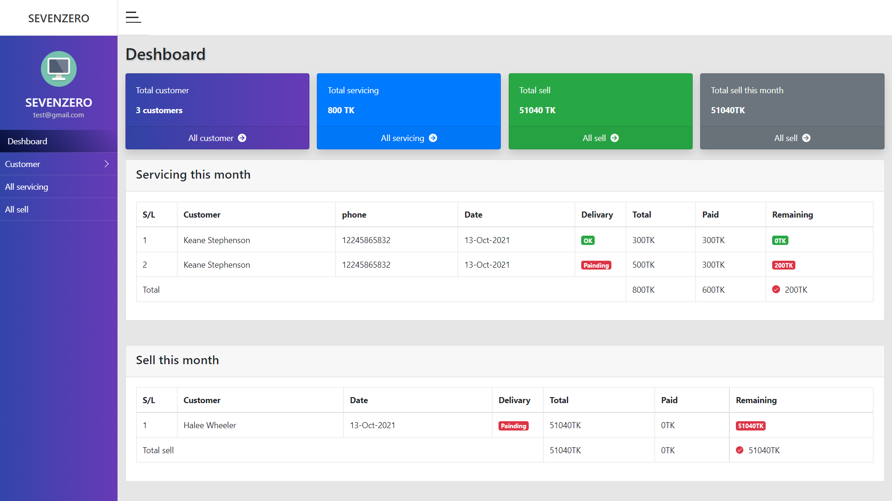

## About This Project

This is a simple Laravel Customer management admin panel for small computer businesses. Admin can add customers, and keep treating financial status, due, total income, etc. 

## Project Feature

- Customer Add and edit.
- Service add edit and delete.
- Sell product to the customer.
- Add sell items, edit, delete, payment information, and print invoice.

## Project setup

Please follow the below instructions to run this project in your computer:
1. Clone this repository
````
git clone https://github.com/nasir23n/sevenzero.git
````
2. Run componer install
````
composer install
````
3. Copy `.env.example` to `.env` Example for linux users :
```
cp .env.example .env
```
4. Create Mysql database on named 
```
sevenzero
```
5. Set valid database credentials of `.env` variables `DB_DATABASE`, `DB_USERNAME`, and `DB_PASSWORD`
6. Import database file into the database `sevenzero` from `DB_SQL_BACKUP/sevenzero.sql`
7. Generate application key
```
php artisan key:generate
```
---

## Contact me
- ✉ Email: [nasrullah23a@gmail.com](mailto:nasrullah23a@gmail.com) <br />
